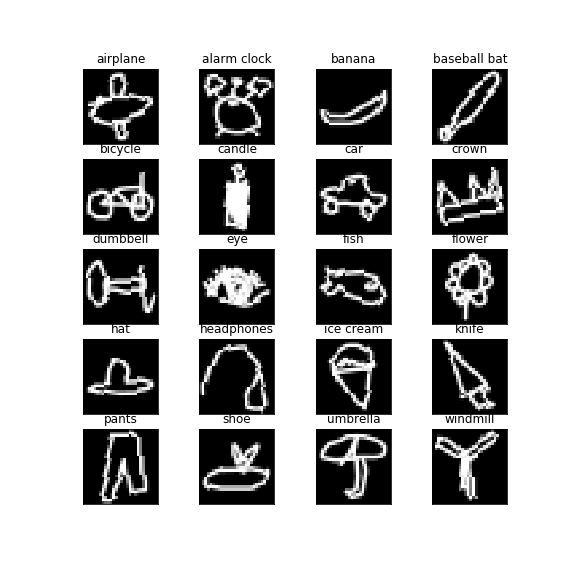
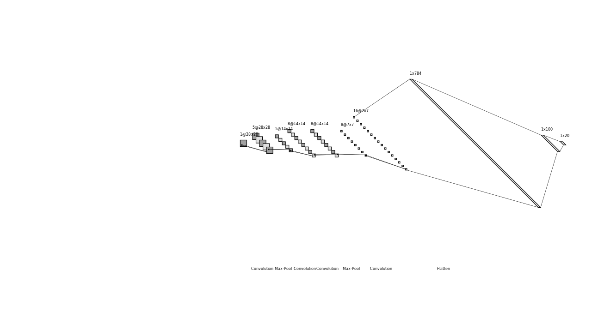
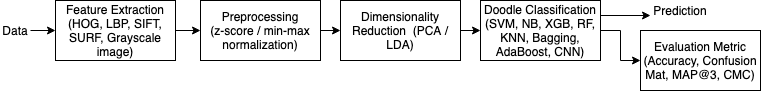
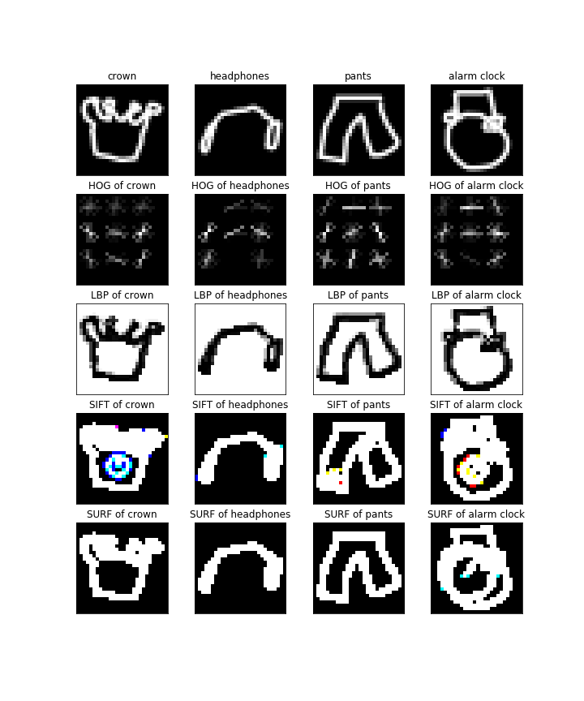
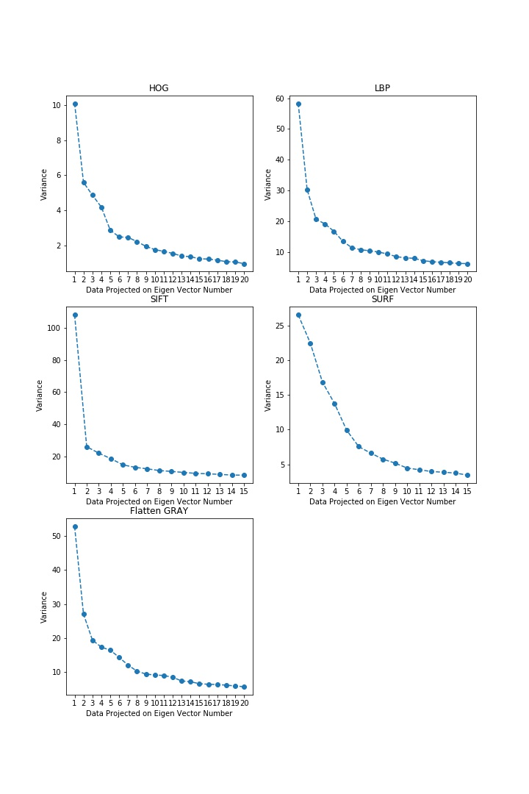
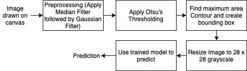
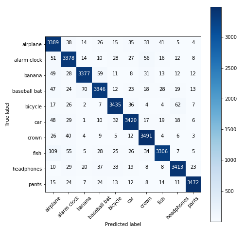
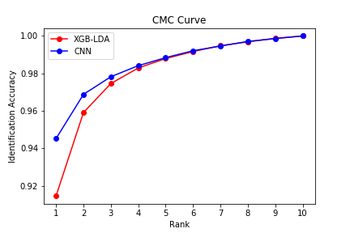
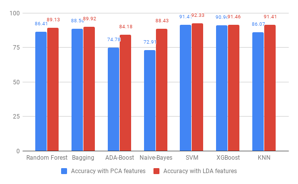
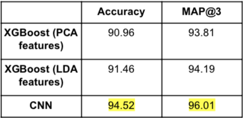

<!-- GitHub README -->

# Automated Hand-Drawn Doodle detection using Machine Learning

## Project Overview

This project is undertaken as the final project of Bachelor's.

In this project, the AI system endeavors to classify hand-drawn doodles into predetermined categories. This project explores different feature extraction techniques like **HOG, LBP, SIFT, SURF, pixel values** alongside feature reduction techniques **PCA, LDA**. Various classifiers, including **Naive Bayes, Random Forest, SVM, XGBoost, Bagging, ADA-boost, KNN, and CNN**, are applied to compare their performance using evaluation metrics such as **Accuracy, MAP@3, CMC Curve, and Confusion Matrix**.

Project Poster can be found in [CV-Poster-Final.pdf](CV-Poster-Final.pdf).

## Problem Usecase

- In Computer Vision & Machine Learning, handling noisy data and datasets with diverse representations of the same class poses a challenge. The Quick Draw Doodle Recognition challenge exemplifies these issues, where users draw the same object differently or create incomplete doodles.
- This application serves as a fast prototyping tool for designers or artists by suggesting accurate templates based on their rough doodles.
- The project can be extended by recognizing hand-drawn alphabets and converting handwritten text into a digital format.

## Dataset

- The Quick Draw dataset comprises millions of doodle drawings across 300+ categories, captured as 28 x 28 grayscale images in .npy format. Due to the large dataset size (~73GB), we utilized a subset of 20 categories.
- The dataset is split into training and test sets (80-20 ratio), with further division for validation. The sampled dataset's doodle images for each class are visualized above.
- [Download Dataset](https://console.cloud.google.com/storage/browser/quickdraw_dataset/full/numpy_bitmap/).

## Proposed Algorithm 

- **CNN Model Architecture**

- We followed a conventional computer vision pipeline for model training, as depicted in the training pipeline below.
  
  

- **Feature Extraction:** Extracted texture information from HOG & LBP, spatial information from SIFT & SURF, and pixel information from grayscale images.
  
  

- **Preprocessing:** Normalized features using Min-Max and Z-score for consistent scaling.
- **Dimensionality Reduction:** Applied PCA or LDA to project features for maximum separation. In PCA, the number of components was selected by analyzing the variance over projected data.
  
  

- **Classification:** Trained and tested different classifiers with varied parameters and feature combinations.
- **Prediction and Evaluation Metrics:** Utilized metrics like accuracy, MAP@3, CMC curve to compare classifier performance.
- For production, a pipeline using contours to find the object was employed.
  
  

## Class Diagram

## Evaluation Metrics and Results

Follwing are the results of the project:

- Confusion Matrices were plotted for best performing classifiers.
  

    
    
  

- Mean Average Precision (MAP@3) score were found for classifiers to find performance in top 3 predictions.
- CMC Curve was plotted to find the identification accuracy at different ranks. 
  
  

- Accuracy of different classifiers was used to compare the performance using PCA and LDA.
  
  

  

## Interpretation of Results

- In Dimensionality reduction technique LDA performs better than PCA as it is able to separate data on the basis of classes.
- Texture based features gave good classification accuracy as compared to other features.
- XGBoost shows best performance as compared to all the other non-deep learning models as the dataset includes images of multiple classes over which XGboost is able to learn better because of boosting technique.
- CNN gives the best performance with a MAP@3 of 96.01%. This is because the kernels are able to learn different feature representations which help the model to differentiate between the classes well.

## References

1. Lu, W., & Tran, E. (2017). Free-hand Sketch Recognition Classification.
2. M. Eitz, J. Hays, and M. Alexa. How do humans sketch objects? ACM Trans. Graph. (Proc. SIGGRAPH), 31(4):44:1– 44:10, 2012.
3. K. He, X. Zhang, S. Ren, and J. Sun. Deep residual learning for image recognition. IEEE Conference on Computer Vision and Pattern Recognition, 2016.
4. Kim, J., Kim, B. S., & Savarese, S. (2012). Comparing image classification methods: K-nearest-neighbor and support-vector machines. Ann Arbor, 1001, 48109-2122.
5. Ha, D., & Eck, D. (2017). A neural representation of sketch drawings. arXiv preprint arXiv:1704.03477.
   
## Project Team Members

M.Koteswara Rao
Y.Rachana Reddy
M.Madhu victor paul
R.Ramya Sri
